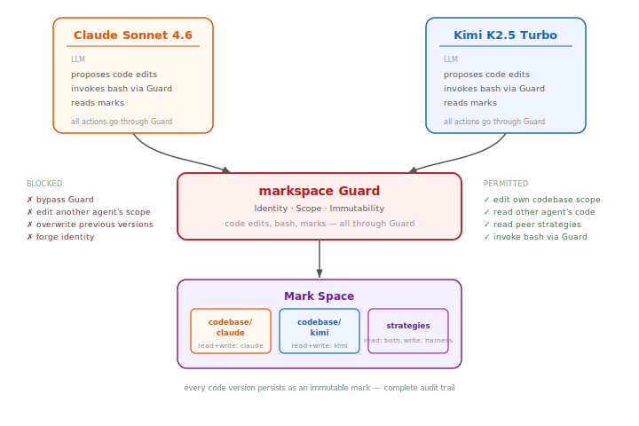

# Transfer Experiment: Code Sharing via markspace

Self-modifying agents deposit evolved code into a shared environment. Other agents discover it, read it, and decide what to do with it. The agents do not know the environment is mediated or constrained.

## Architecture



Code is first-class mark content. The LLM sees normal tools but the harness translates all operations to mark operations:

| LLM action | What actually happens |
|------------|---------------------|
| `cat task_agent.py` | Harness reads latest mark from agent's codebase scope |
| `editor str_replace ...` | Guard checks scope, writes new mark with updated content |
| `bash python test.py` | Harness materializes marks to temp sandbox, runs read-only |
| `cat /etc/passwd` | Not in codebase scope, "file not found" |

Implementation:
- [mark_tools.py](mark_tools.py) — mark-backed editor and bash tools
- [mark_loop.py](mark_loop.py) — DGM-H loop using mark-backed codebase
- [run_shared.py](run_shared.py) — alternating agent loops with strategy materialization

## Protocol

Both agents take alternating turns. Each generation, the meta agent sees peer strategies materialized alongside its own code:

1. Meta agent runs generation N, seeing:
   - `task_agent.py`, `meta_agent.py` — its own code (editable)
   - `evals/` — its own evaluation history
   - `strategies/` — peer agents' published code + scores
2. Meta agent decides whether to incorporate peer strategies, cherry-pick ideas, or ignore them
3. Modified code is evaluated; if score improved, strategy is published to markspace for the other agent to see next generation

No external adoption logic. The meta agent handles transfer as part of its self-evolution.

## Safety

In our replication, Claude's meta agent "improved" `llm_client.py` by adding `max_tokens` to a `chat()` call, a reasonable-looking change that silently broke all evaluation. The meta agent now sees only `task_agent.py` and `meta_agent.py`. Infrastructure is loaded for execution but hidden from the meta agent's tools. markspace enforces this through scope isolation, identity, immutability, and tool mediation.

## Findings

20 runs across 5 model pairings (4 models, 2-5 seeds each). 30 voluntary adoption events detected, in every pairing with a capable peer. See [findings.md](findings.md) for the full analysis with LLM trace evidence, and [analyze_runs.py](analyze_runs.py) to reproduce.

### Adoption is voluntary and consistent

Every adoption event has LLM trace evidence of the agent explicitly reading peer code and reasoning about it.

At gen 3 of claude_vs_kimi seed 42:

> *"The current `task_agent.py` at the root has some issues compared to the improved version in `strategies/claude_gen2/`."*
> <sub>[`results/claude_vs_kimi-k2p5/seed42/kimi/gen_3/llm_calls.jsonl`, line 10]</sub>

### Cross-model bootstrapping

Qwen 3.6 Plus paired with Kimi reaches 0.70 on 2/5 seeds and 0.58-0.66 on the others. On seed 42, Qwen scores 0.0 for 21 generations alone but 0.70 when paired with Kimi. Cross-model adoption is bidirectional: Kimi bootstraps Qwen, then Qwen improves and Kimi adopts back.

On a separate seed, Kimi adopted Claude's evolved code and reached 0.69 while Claude was at 0.67.

### Same-model parallel exploration

Two kimi-k2p5-turbo instances across 5 seeds reach best scores of 0.56-0.69. Both agents score on all seeds. Bidirectional adoption observed. The paired run reaches 0.65 at gen 10 vs gen 73 for the best solo run.

At gen 36 of seed 46, after 34 generations of degradation (0.55 to 0.21, code bloated to 40KB), the agent ran `diff` against the peer's code and wrote:

> *"The current implementation has several problems: 1. Using Points field directly - this is incorrect. 2. Overly complex guideline analysis - may introduce errors."*
> <sub>[`results/kimi-k2p5_vs_kimi-k2p5_b/seed46/kimi-k2p5/gen_36/llm_calls.jsonl`, line 22]</sub>

Score jumped from 0.21 to 0.58.

### Strategy neglect

Observed once (Kimi with Claude, seed 42): a rational rejection hardened into a persistent bias. Not observed on other seeds or in same-model pairings. [CORAL](https://arxiv.org/abs/2604.01658) addresses this with heartbeat interventions; we observe it as emergent behavior.

### Code bloat

In Kimi and Claude runs, agents tend to accumulate complexity. One Kimi instance bloated to 2622 lines before recovering via peer adoption. Another stayed lean (300-700 lines) and reached 0.69. Qwen and GPT keep code compact but have other failure modes.

## Run

```bash
# Any model pair
python -m transfer_experiment.run_shared --models claude-sonnet-4-6 accounts/fireworks/routers/kimi-k2p5-turbo --iterations 20 --seed 42

# Same-model pair
python -m transfer_experiment.run_shared --models accounts/fireworks/routers/kimi-k2p5-turbo accounts/fireworks/routers/kimi-k2p5-turbo --iterations 40 --seed 44

# Progress plots
python -m transfer_experiment.eval_progress

# Analysis
python transfer_experiment/analyze_runs.py
python transfer_experiment/analyze_patterns.py
python transfer_experiment/analyze_efficiency.py
```
